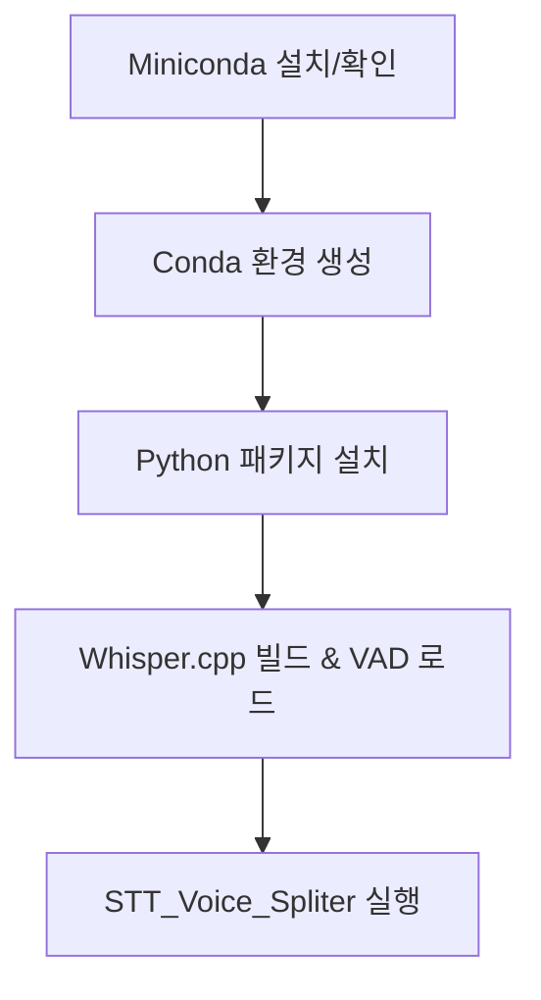

# 🗣️ STT Voice Splitter (Whisper 기반 음성 필사 GUI)

Whisper.cpp + Silero VAD + Tkinter 기반의 **오디오 필사 자동화 GUI** 도구입니다.  
MacOS(M1/M2 포함)에서 Conda 환경과 CoreML을 활용하여, 누구나 쉽게 오디오를 분할하고 텍스트로 변환할 수 있습니다.
윈도우 및 Intel기반 Mac은 지원하지 않습니다

---

## 🗣️ 필요 종속성

1.brew
2.git
3.Python3.11 이상 권장
4.pip

## ✨ 주요 기능

- ✅ Whisper.cpp 자동 설치 및 빌드
- ✅ Silero VAD를 통한 음성 구간 자동 분리
- ✅ Whisper CLI를 통한 고속 필사 (한국어 지원)
- ✅ Tkinter GUI 제공 (설정 저장, 로그 출력 등)
- ✅ macOS (Intel/ARM) 환경 자동 인식 및 최적화

---

## 💻 설치 및 실행 방법

# 1. GitHub 저장소 클론

```bash
git clone https://github.com/MuseBlossom-Development/deepvoice-stt-VoiceSpliter.git
cd deepvoice-stt-VoiceSpliter
```


## ⚠️ Whisper 모델 파일은 직접 받아야 합니다

Whisper 모델 파일은 **용량 문제로 GitHub에 포함되지 않았습니다**.  
위치 : 공용 드라이브/공용 폴더/개발프로젝트/DeepVoice/STT/STT_Model/resources/
사내 네트워크 저장소 또는 별도 공유 경로에서 아래 파일들을 다운로드한 후, `resources/` 폴더 안에 넣어주세요.

## 📁 resources/ 폴더에 위치해야 할 파일:
 `resources/ggml-large-v3-turbo.bin`
 `resources/ggml-large-v3-turbo-encoder.mlmodelc/` *(디렉토리 전체)*

# 3. 실행 권한 부여

```bash
chmod +x setup_and_run.sh
```


# 4. 설치 및 실행

```bash
./setup_and_run.sh
```

## 동작 개요

아래 다이어그램은 전체 설치 및 실행 과정의 핵심 흐름을 간략하게 보여줍니다.



## 📁 디렉토리 구조

```bash
stt-voice-splitter/
├── setup_and_run.sh                 # 설치 및 실행 스크립트
├── STT_Voice_Spliter.py            # GUI 메인 코드
├── resources/                      # 모델 및 인코더 위치
│   ├── ggml-large-v3-turbo.bin
│   └── ggml-large-v3-turbo-encoder.mlmodelc/
├── config.json                     # VAD 설정 파일
└── split_audio/                    # 오디오 분할 및 필사 결과 폴더


| 분류         | 기술 내용                                     |
|--------------|----------------------------------------------|
| **GUI**      | Tkinter (Python 기본 GUI 툴킷)               |
| **필사 엔진**| Whisper.cpp (ggml-org/whisper.cpp)           |
| **음성 감지**| Silero VAD (PyTorch 기반)                   |
| **오디오 처리** | FFmpeg                                    |
| **모델 추론**| CoreML (macOS M1/M2 최적화용)               |
| **패키지 관리자** | Conda / Homebrew                        |
```